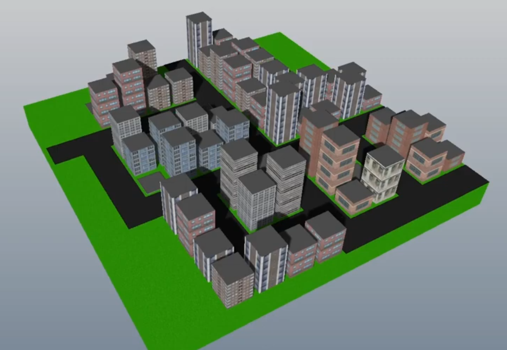
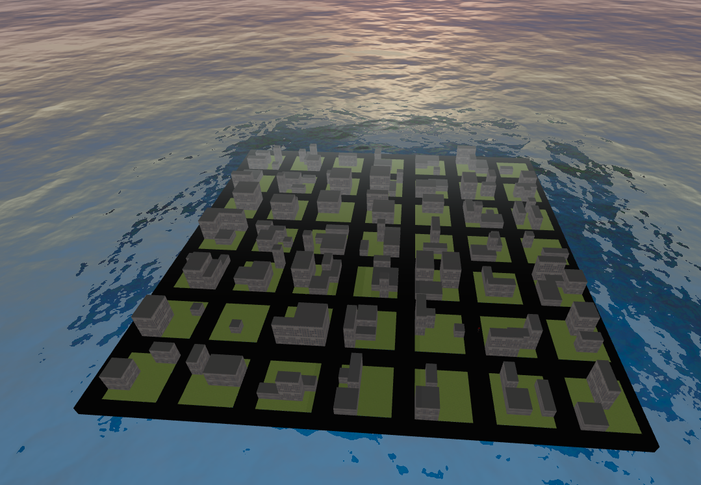
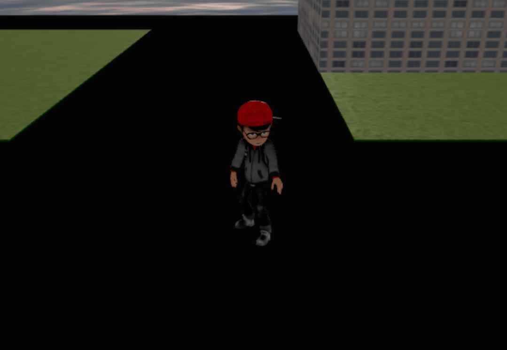
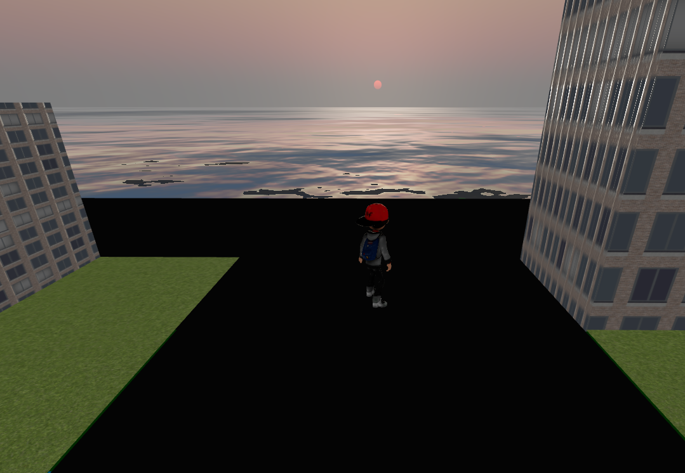

# CS 360 Graphics Project

**Emmanuel Bonojo**

## About

This project is a procedural city built using Three.js. It generates a grid-based environment with buildings, roads, and a third-person controllable character. Environmental effects include fog, water, and a dynamic sky system.

### Inspiration

The idea came from a "Build simCIty with THREE.js" tutorial on YouTube.
[Click here to visit the playlist](https://youtu.be/bs-c8gxdWrM?si=kAjSuCoiiE3IWagM)

## More Info

The city is generated using a 2D grid data structure that defines roads and buildings. Buildings vary in size and are procedurally placed.

**Concepts used:**
- Built-in geometry modeling
- Texture mapping
- Lighting and shadows
- Shaders
- Animation and camera control

### Screenshots

*View of the scene from the orbital camera.*

*Close-up of the character model.*

*Third-person gameplay view.*

## Project Demo

[Click here to run the demo](project6.html)
