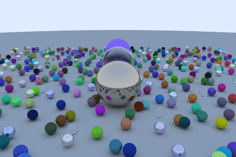

# Ray Tracing in One Weekend

A C++ implementation following Peter Shirley's *Ray Tracing in One Weekend*. Renders a scene of randomly generated spheres with lambertian, metal, and dielectric (glass) materials, with support for generating an orbiting camera animation as a GIF.



## Requirements

- A C++ compiler (`g++` recommended)
- **ImageMagick** — used to convert rendered `.ppm` frames into `.png` and combine them into a `.gif`
  ```bash
  sudo apt install imagemagick
  ```
- An image viewer capable of opening `.ppm` files, such as **Eye of GNOME (`eog`)** or **GIMP**. Most standard image viewers do *not* support `.ppm` natively, so if double-clicking doesn't work, open it with one of these instead:
  ```bash
  eog raytracer.ppm
  ```

## About the `.ppm` format

The renderer outputs images in **PPM (Portable Pixmap)** format — a simple, uncompressed plain-text image format that's easy to write directly from C++ without needing an image library. It's not widely supported by default image viewers or web browsers, so it's usually converted to `.png` for viewing/sharing (see below).

## Building the project

From inside this project folder:
```bash
g++ -O2 main.cpp -o raytracer
```

## Running a single render

The program takes a **frame number** as a command-line argument and outputs a numbered `.ppm` file (e.g. `frame_000.ppm`):
```bash
./raytracer 0
```

To render just one static image, run it once with frame `0`.

## Rendering a full animation (orbit)

The camera orbits around the scene across `num_frames` (60 by default, set in `main.cpp`). Each frame must be rendered as a separate run of the program.

**Render all frames sequentially:**
```bash
for i in $(seq 0 59); do
    ./raytracer $i
done
```

**Or render in parallel** (faster on multi-core machines — adjust `-P` to roughly your CPU core count, found via `nproc`):
```bash
seq 0 59 | xargs -P 14 -I {} ./raytracer {}
```

**Confirm all frames were created:**
```bash
ls frame_*.ppm | wc -l   # should print 60
```

## Converting frames to a GIF

**1. Convert each `.ppm` frame to `.png`:**
```bash
for f in frame_*.ppm; do convert "$f" "${f%.ppm}.png"; done
```

**2. Combine the PNGs into an animated GIF:**
```bash
convert -delay 5 -loop 0 frame_*.png orbit.gif
```
- `-delay 5` sets the delay between frames in 1/100ths of a second (~20 fps). Increase this number to slow the animation down.
- `-loop 0` makes the GIF loop forever.

**3. Preview the result:**
```bash
eog orbit.gif
```

## Cleaning up intermediate files

The individual `.ppm` and `.png` frames are just intermediate build artifacts used to create the final GIF — once `orbit.gif` exists, they can be safely deleted:
```bash
rm frame_*.ppm frame_*.png
```

These files (along with any single-render `raytracer.ppm`/`.png`) are excluded from version control via `.gitignore`.

## Project structure

```
raytracing_in_one_weekend/
├── main.cpp          # entry point, scene setup, render loop
├── camera.h           # camera and view ray generation
├── ray.h               # ray class
├── vec3.h              # 3D vector math
├── hitable.h           # base class for renderable objects
├── hitable_list.h      # collection of hitable objects
├── sphere.h             # sphere primitive
├── material.h            # base material class
├── lambertian.h           # diffuse material
├── metal.h                # reflective material
├── dielectric.h            # glass/refractive material
└── orbit.gif                # rendered orbit animation
```
